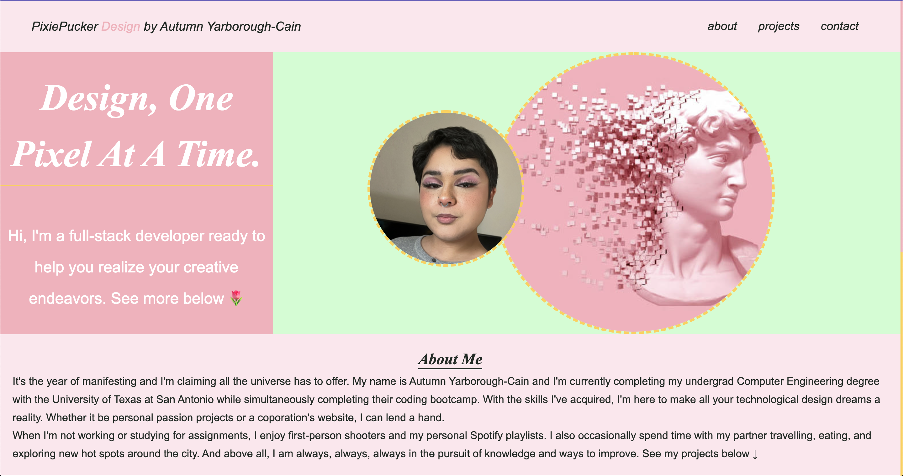
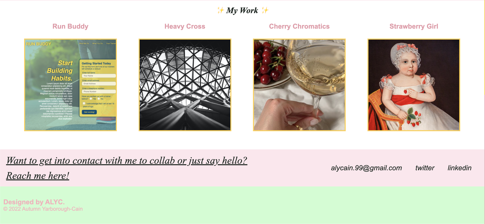

# Autumn Cain's Portfolio Design
## Week 2 Challenge

This week's challenge was to design a portfolio that we will continue to contribute to during our 6 month bootcamp. After vigorous research on Dribbble and Awwwards, I was able to put together my first design portfolio!

The color pallete for my portfolio was heavily inspired by my favorite colors; pink, yellow, and green, but in pastel. The pink pixelation of the head statue was inspired by games like Stardew Valley and Undertale. I love pixel art and seek to incorporate it wherever I can! I also wanted to make sure my containers for my projects could horizontally scroll in order to bring some uniqueness to my portfolio. 

- Overall I was able to:
    - Use semantic tags to build the skeleton of my portfolio site, link a favicon.ico and stylesheet in order to style and bring some life to the site.
    - Incorporate elements of design that were as close to my personal taste as I could achieve at this point in time.
    - Add mediaqueries to help make the site more accesible across all platforms, from phones to desktops.

Although it's only the second week, I was able to learn a lot and feel a strong sense of accomplishment by completing [this week's challenge.](https://pixiepucker.github.io/portfolio-design/)

### Preview of my Portfolio ✨

### Credits
Scenario and instruction provided by UTSA's Trilogy Coding Bootcamp.

